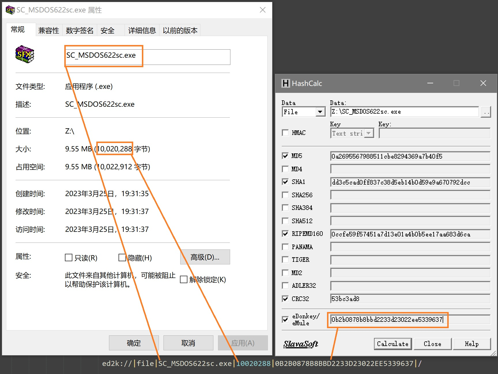

# hashcalc
* https://www.slavasoft.com/hashcalc/
* 安装后只需取出hashcalc.exe

## 例子
* 文件名可以随意改
* 必须在其他服务器上有对应的资源
```
ed2k://|file|SC_MSDOS622sc.exe|10020288|0B2B0878B8BBD2233D23022EE5339637|/
```



                             
