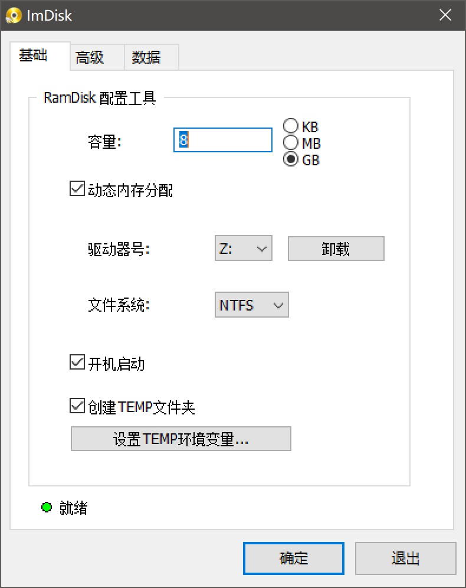
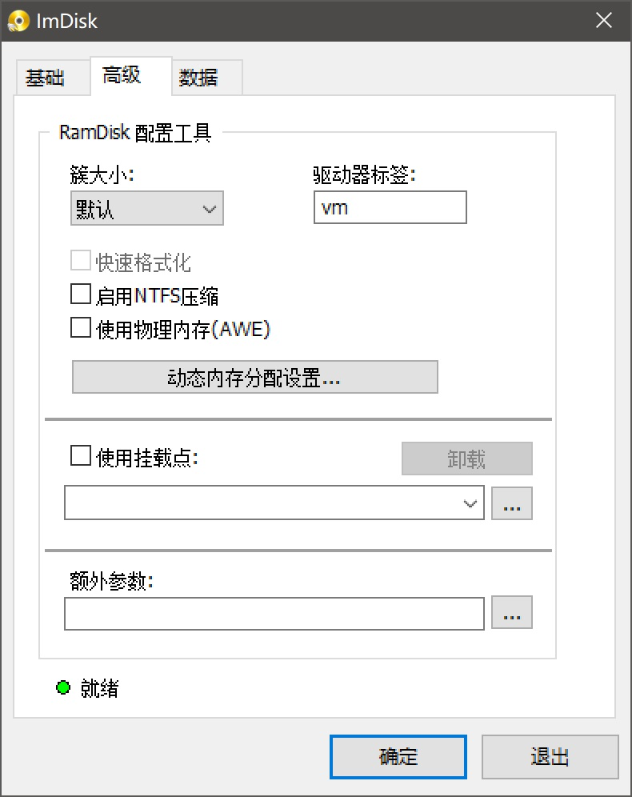
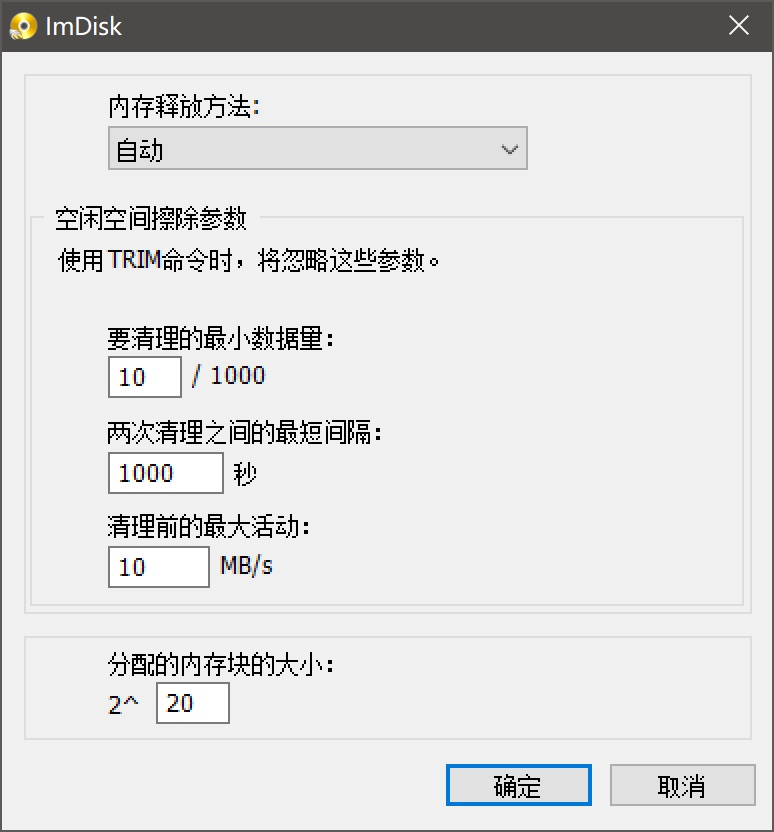
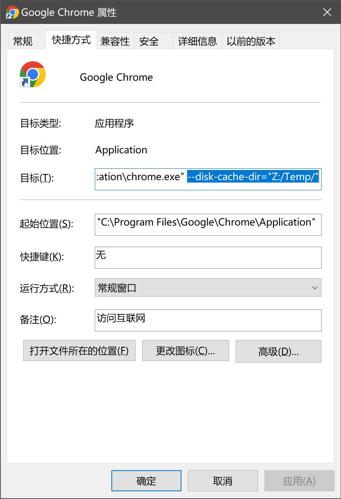
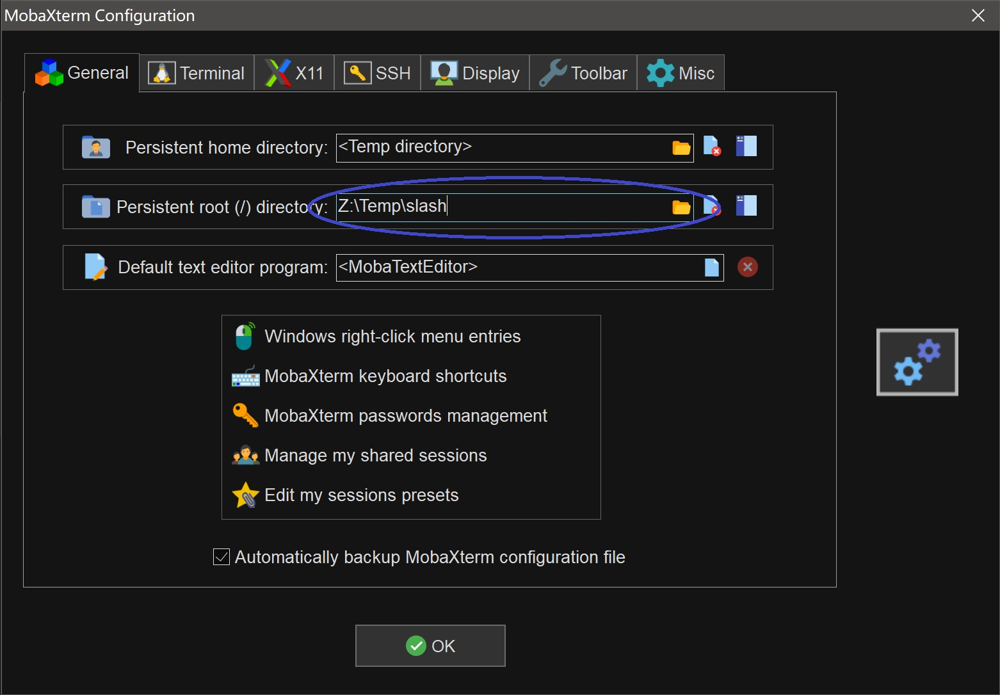

# 虚拟内存开源软件ImDisk Toolkit Files
* https://sourceforge.net/projects/imdisk-toolkit/files/
* 对比其他虚拟硬盘软件,可以动态扩展(amd与rog的不支持动态扩展)

## 配置





## 浏览器缓存设置
* 一般浏览器的菜单位置 C:\ProgramData\Microsoft\Windows\Start Menu\Programs
* 给浏览器的启动添加参数 --disk-cache-dir="Z:/Temp/"

```
"C:\Program Files\Google\Chrome\Application\chrome.exe" --disk-cache-dir="Z:/Temp/"
```


## mobaxterm缓存设置
