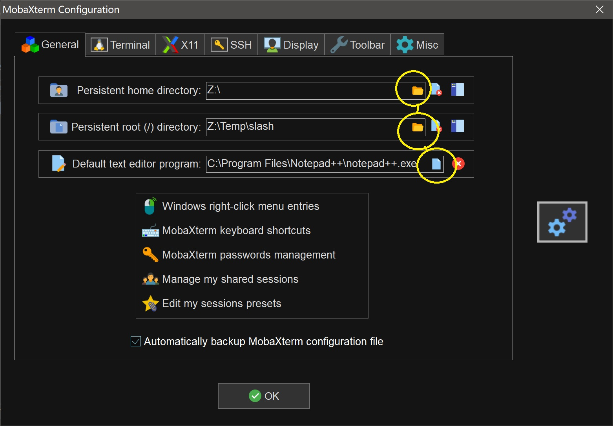
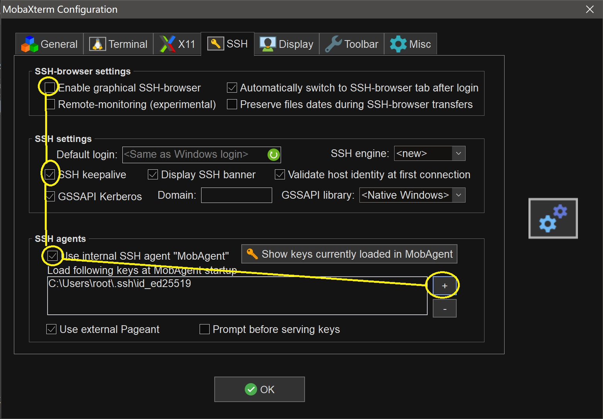
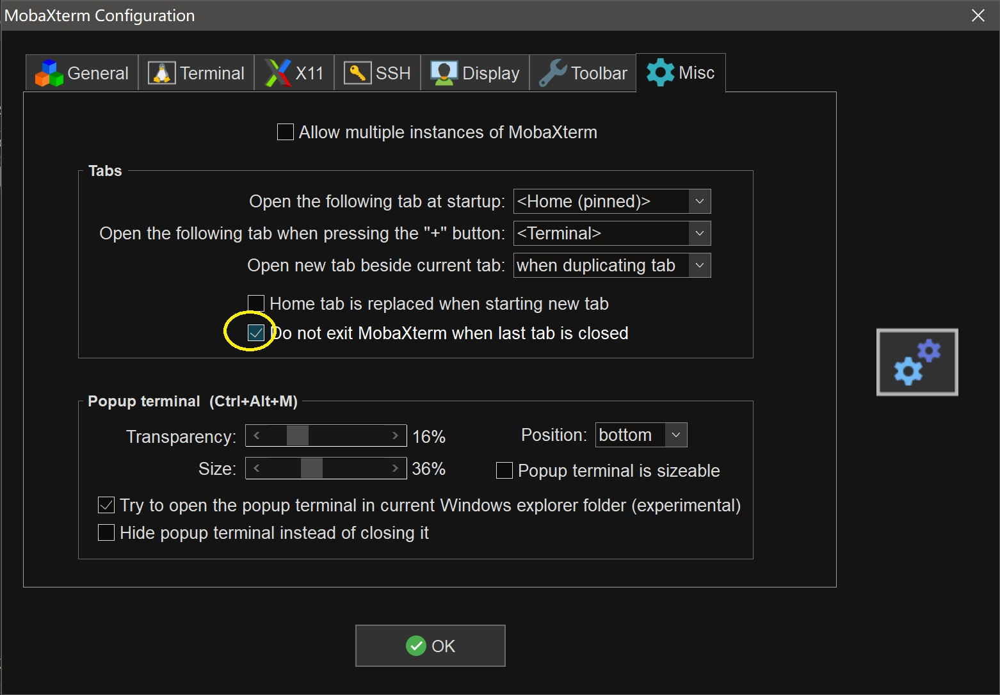

# mobaxterm使用

# 专业版密钥
* https://inused.github.io/pages/file/tool/MobaXtermKeygen.html
* Custom.mxtpro为23.3版本的授权备份
# general

* 设置bash进入的默认目录
* busybox的默认目录位置(这里配合imdisk虚拟内存)
* 默认编辑器

# ssh

* 默认不启用ssh浏览器
* ssh保持连接状态
* 导入默认密钥

# ssh

* 关闭最后一个标签时不关闭应用

# 快捷键
* Ctrl+M 隐藏到通知栏


## gcc
| 使用gcc有两种方式,可以提前下载插件包放在软件同目录,此方式的gcc太旧会无法在windows下运行
* 故使用apt在线安装gcc的方式
```bash
apt install gcc-core -y
gcc h.c -o a.exe
```
* 编译后的a.exe可以放在windows下运行,但是需要依赖cygwin1.dll(这gcc是cygwin里的)
* cygwin1.dll在目录下可以找到"find /bin/ -name cygwin1.dll"
* cygwin1.dll直接往C:/Windows里丢一个

| 编译成汇编文件h.s
```
gcc h.c -S h.s
cat h.s
```
| 查看依赖
```
strings a.exe
```